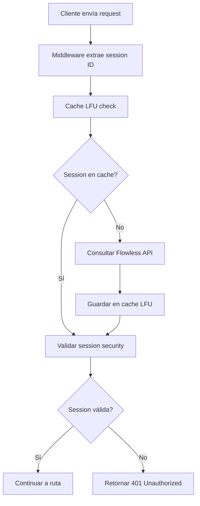

# Protected Routes with Bridge Validator

Esta guía explica cómo crear rutas protegidas de forma segura usando el sistema de autenticación de FLOWFULL con Bridge Validator.

## 🔐 Flujo de Autenticación

### 1. **Cómo Funciona Bridge Validator**



### 2. **Componentes del Sistema**

- **Bridge Validator**: Valida sessions con Flowless backend
- **LFU Cache**: Cache optimizado para sessions frecuentes
- **Session Security**: Validación de IP, User-Agent, Device
- **Auth Middleware**: Middleware que protege rutas

## 🛡️ Creando Rutas Protegidas

### 1. **Estructura Básica**

```typescript
import { Hono } from 'hono';
import { z } from 'zod';
import { authMiddleware } from '@/lib/auth/auth-middleware';

const app = new Hono();

// Ruta protegida básica
app.get('/protected', authMiddleware, async (c) => {
  const user = c.get('user'); // Usuario autenticado
  
  return c.json({
    message: 'Acceso autorizado',
    user: {
      id: user.id,
      email: user.email,
      userType: user.userType
    }
  });
});
```

### 2. **Ruta con Validación de Datos**

```typescript
// Schema de validación
const createItemSchema = z.object({
  name: z.string().min(1).max(100),
  description: z.string().optional(),
  category: z.string().min(1).max(50)
});

app.post('/items', authMiddleware, async (c) => {
  try {
    // 1. Obtener usuario autenticado
    const user = c.get('user');
    
    // 2. Validar datos de entrada
    const body = await c.req.json();
    const validatedData = createItemSchema.parse(body);
    
    // 3. Lógica de negocio
    const item = {
      id: crypto.randomUUID(),
      ...validatedData,
      createdBy: user.id,
      createdAt: new Date().toISOString()
    };
    
    // 4. Respuesta exitosa
    return c.json({
      success: true,
      data: item
    }, 201);
    
  } catch (error) {
    // 5. Manejo de errores
    if (error instanceof z.ZodError) {
      return c.json({
        error: 'Datos inválidos',
        details: error.errors
      }, 400);
    }
    
    return c.json({
      error: 'Error interno del servidor'
    }, 500);
  }
});
```

### 3. **Ruta con Validación de Permisos**

```typescript
app.delete('/admin/users/:id', authMiddleware, async (c) => {
  const user = c.get('user');
  const targetUserId = c.req.param('id');
  
  // Validar permisos de administrador
  if (user.userType !== 'admin') {
    return c.json({
      error: 'Acceso denegado',
      message: 'Se requieren permisos de administrador'
    }, 403);
  }
  
  // Prevenir auto-eliminación
  if (user.id === targetUserId) {
    return c.json({
      error: 'Operación no permitida',
      message: 'No puedes eliminar tu propia cuenta'
    }, 400);
  }
  
  // Lógica de eliminación...
  return c.json({
    success: true,
    message: 'Usuario eliminado correctamente'
  });
});
```

## 🔒 Mejores Prácticas de Seguridad

### 1. **Siempre Usar authMiddleware**

```typescript
// ✅ CORRECTO
app.get('/protected', authMiddleware, async (c) => {
  // Ruta protegida
});

// ❌ INCORRECTO - Sin protección
app.get('/sensitive-data', async (c) => {
  // Datos sensibles sin autenticación
});
```

### 2. **Validar Todos los Inputs**

```typescript
// ✅ CORRECTO - Con validación
const schema = z.object({
  email: z.string().email(),
  age: z.number().min(18).max(120)
});

app.post('/update-profile', authMiddleware, async (c) => {
  const body = await c.req.json();
  const validatedData = schema.parse(body); // Validación obligatoria
  // ...
});

// ❌ INCORRECTO - Sin validación
app.post('/update-profile', authMiddleware, async (c) => {
  const body = await c.req.json(); // Datos no validados
  // Riesgo de inyección y datos corruptos
});
```

### 3. **Manejo Seguro de Errores**

```typescript
// ✅ CORRECTO - No exponer información sensible
app.get('/user/:id', authMiddleware, async (c) => {
  try {
    const user = await getUserById(id);
    return c.json({ data: user });
  } catch (error) {
    // Log interno del error completo
    console.error('Database error:', error);
    
    // Respuesta genérica al cliente
    return c.json({
      error: 'Error al obtener usuario'
    }, 500);
  }
});

// ❌ INCORRECTO - Exponer detalles internos
app.get('/user/:id', authMiddleware, async (c) => {
  try {
    const user = await getUserById(id);
    return c.json({ data: user });
  } catch (error) {
    // Expone información sensible
    return c.json({
      error: error.message, // Puede contener info de DB
      stack: error.stack    // Expone estructura interna
    }, 500);
  }
});
```

### 4. **Validación de Permisos Granular**

```typescript
// ✅ CORRECTO - Validación específica
app.put('/posts/:id', authMiddleware, async (c) => {
  const user = c.get('user');
  const postId = c.req.param('id');
  
  // Obtener el post
  const post = await getPostById(postId);
  if (!post) {
    return c.json({ error: 'Post no encontrado' }, 404);
  }
  
  // Validar ownership o permisos de admin
  if (post.authorId !== user.id && user.userType !== 'admin') {
    return c.json({ error: 'Sin permisos para editar' }, 403);
  }
  
  // Proceder con la actualización
});
```

## ⚠️ Errores Comunes a Evitar

### 1. **No Validar Session en Cada Request**

```typescript
// ❌ INCORRECTO - Asumir que la session es válida
app.get('/data', async (c) => {
  const sessionId = c.req.header('X-Session-ID');
  // Usar sessionId sin validar
});

// ✅ CORRECTO - Usar middleware
app.get('/data', authMiddleware, async (c) => {
  const user = c.get('user'); // Ya validado por middleware
});
```

### 2. **Exponer Información Sensible**

```typescript
// ❌ INCORRECTO
app.get('/profile', authMiddleware, async (c) => {
  const user = c.get('user');
  return c.json(user); // Puede incluir campos sensibles
});

// ✅ CORRECTO
app.get('/profile', authMiddleware, async (c) => {
  const user = c.get('user');
  return c.json({
    id: user.id,
    email: user.email,
    name: user.name
    // Solo campos necesarios
  });
});
```

### 3. **No Validar Parámetros de URL**

```typescript
// ❌ INCORRECTO
app.get('/users/:id', authMiddleware, async (c) => {
  const id = c.req.param('id'); // Sin validación
  const user = await getUserById(id);
});

// ✅ CORRECTO
const userIdSchema = z.string().uuid();

app.get('/users/:id', authMiddleware, async (c) => {
  try {
    const id = userIdSchema.parse(c.req.param('id'));
    const user = await getUserById(id);
  } catch (error) {
    return c.json({ error: 'ID inválido' }, 400);
  }
});
```

## 📋 Checklist de Seguridad

Antes de deployar una ruta, verifica:

- [ ] ✅ Usa `authMiddleware` para rutas protegidas
- [ ] ✅ Valida todos los inputs con Zod schemas
- [ ] ✅ Verifica permisos específicos cuando sea necesario
- [ ] ✅ Maneja errores sin exponer información sensible
- [ ] ✅ Valida parámetros de URL y query strings
- [ ] ✅ Usa HTTPS en producción
- [ ] ✅ Configura CORS correctamente
- [ ] ✅ Implementa rate limiting
- [ ] ✅ Logs de seguridad para acciones sensibles

## 🔗 Referencias

- [Database Configuration](./database-setup.md)
- [Environment Variables](./environment-setup.md)
- [Authentication Modes](./auth-modes.md)
- [Error Handling](./error-handling.md)
