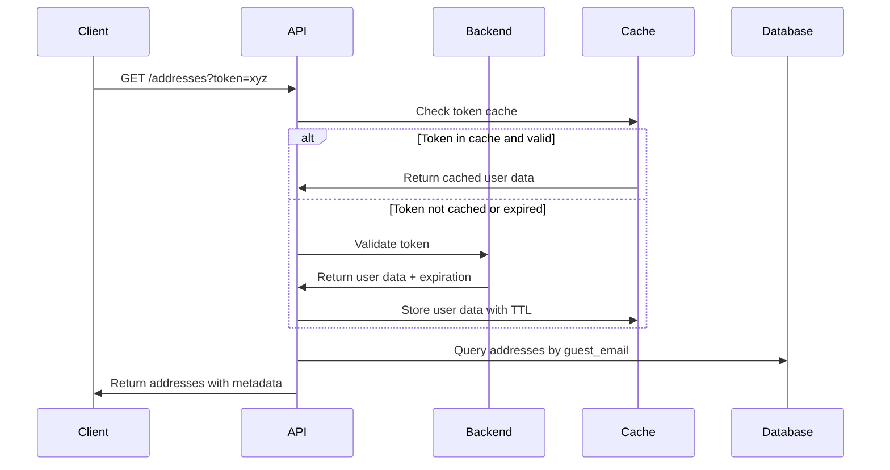

# Addresses API Documentation - Complete Reference

The Addresses API provides comprehensive address management functionality for both authenticated users and guest users with token-based access. This API supports billing and shipping addresses with advanced filtering, pagination, guest token authentication, and full CRUD operations.

## Base URL

```
https://your-domain.com/bridge-payment/addresses
```

## Authentication

- **Authenticated Users**: Include `Authorization: Bearer <token>` header
- **Guest Users with Tokens**: Use `?token=<guest_token>` query parameter for address access
- **Anonymous Guest Users**: No authentication required for address creation with guest data

## Address Types

- `billing` - Billing address only
- `shipping` - Shipping address only
- `both` - Can be used for both billing and shipping

## Complete API Reference

| Method | Endpoint | Description | Auth Required |
|--------|----------|-------------|---------------|
| GET | `/addresses` | List user addresses | Yes* |
| GET | `/addresses?token=<token>` | List guest addresses with token | Token Required |
| GET | `/addresses/:id` | Get address by ID | Yes* |
| GET | `/addresses/:id?token=<token>` | Get guest address by ID with token | Token Required |
| POST | `/addresses` | Create new address | Optional |
| PUT | `/addresses/:id` | Update address | Yes* |
| DELETE | `/addresses/:id` | Delete address | Yes* |

*For authenticated users or guest users with valid tokens

---

## Guest Token Authentication System

For guest users who need to access their addresses after checkout, the API supports token-based authentication. This allows guests to view and manage their address information without creating a full account.

### How Guest Tokens Work

1. **Token Generation**: Guest tokens are generated by your authentication backend
2. **Token Validation**: The API validates tokens with your backend service
3. **Address Access**: Valid tokens allow access to addresses associated with the guest's email
4. **Caching**: Validated tokens are cached for performance (configurable timeout)
5. **Fallback Search**: If token validation fails, attempts fallback search by token-email mapping

### Token Validation Flow



### Configuration

The guest token system requires these environment variables:

```env
# Backend authentication service URL
FLOWLESS_API_URL=https://your-auth-backend.com

# Token validation timeout (milliseconds) - no limit by default
AUTH_TIMEOUT=25000

# Response format mode
ROW_MODE=false

# Cache settings (optional)
TOKEN_CACHE_TTL=300000  # 5 minutes default
```

### Backend Integration

Your authentication backend should provide an endpoint:

```http
GET /auth/token/validate?token=<guest_token>
```

**Expected Response:**
```json
{
  "success": true,
  "user": {
    "id": "guest_user_123",
    "email": "guest@example.com",
    "name": "Guest User",
    "isVerified": true
  },
  "tokenType": "token_login",
  "token_id": "tok_abc123",
  "expires_at": "2025-06-05T03:34:29.000Z"
}
```

**Error Response:**
```json
{
  "success": false,
  "error": "Invalid token",
  "message": "Token not found or expired"
}
```

---

## List User Addresses

Retrieve a list of addresses for authenticated users or guest users with tokens.

### Request

```http
GET /bridge-payment/addresses
GET /bridge-payment/addresses?token=<guest_token>
```

#### Query Parameters

| Parameter | Type | Required | Description |
|-----------|------|----------|-------------|
| `token` | string | No* | Guest access token (*required for guest users) |
| `page` | number | No | Page number (default: 1) |
| `limit` | number | No | Number of results per page (default: 10, max: 50) |
| `address_type` | string | No | Filter by address type: `billing`, `shipping`, `both` |
| `search` | string | No | Search in name, city, postal code |
| `orderBy` | string | No | Sort field: `created_at`, `name`, `city`, `country` |
| `orderDir` | string | No | Sort direction: `asc` or `desc` (default: `desc`) |

#### Headers

```http
Authorization: Bearer <token>  # Required for authenticated users
Content-Type: application/json
```

### Response Format

The API supports two response formats controlled by the `ROW_MODE` environment variable:

#### Standard Format (ROW_MODE=false, default)

```http
HTTP/1.1 200 OK
Content-Type: application/json
```

```json
{
  "success": true,
  "data": [
    {
      "id": "addr_1234567890",
      "address_type": "billing",
      "name": "John Doe",
      "line1": "123 Main Street",
      "line2": "Apt 4B",
      "city": "New York",
      "state": "NY",
      "postal_code": "10001",
      "country": "US",
      "phone": "+1-555-123-4567",
      "email": "john@example.com",
      "is_default": true,
      "is_guest": true,
      "guest_email": "guest@example.com",
      "guest_name": "Guest User",
      "created_at": "2025-01-15T10:30:00Z",
      "updated_at": "2025-01-15T10:35:00Z"
    }
  ],
  "meta": {
    "query": "",
    "page": 1,
    "limit": 10,
    "total": 25,
    "hasMore": true,
    "orderBy": "created_at",
    "orderDir": "desc"
  },
  "user_context": {
    "authenticated": true,
    "user_id": "user_123",
    "user_type": "guest",
    "user_email": "guest@example.com",
    "search_method": "guest_email",
    "access_method": "guest_token_access"
  }
}
```

#### Row Format (ROW_MODE=true)

```json
{
  "success": true,
  "data": {
    "rows": [
      {
        "id": "addr_1234567890",
        "address_type": "billing",
        "name": "John Doe",
        "line1": "123 Main Street",
        "line2": "Apt 4B",
        "city": "New York",
        "state": "NY",
        "postal_code": "10001",
        "country": "US",
        "phone": "+1-555-123-4567",
        "email": "john@example.com",
        "is_default": true,
        "is_guest": true,
        "created_at": "2025-01-15T10:30:00Z",
        "updated_at": "2025-01-15T10:35:00Z"
      }
    ]
  },
  "meta": {
    "query": "",
    "page": 1,
    "limit": 10,
    "total": 25,
    "hasMore": true,
    "orderBy": "created_at",
    "orderDir": "desc"
  },
  "user_context": {
    "authenticated": true,
    "user_id": "user_123",
    "user_type": "guest",
    "user_email": "guest@example.com",
    "search_method": "guest_email"
  }
}
```

### Examples

#### Authenticated User Addresses
```bash
curl -X GET "https://api.example.com/bridge-payment/addresses?page=1&limit=20&address_type=billing" \
  -H "Authorization: Bearer your_token_here" \
  -H "Content-Type: application/json"
```

#### Guest User Addresses with Token
```bash
curl -X GET "https://api.example.com/bridge-payment/addresses?token=guest_token_here&page=1&limit=10" \
  -H "Content-Type: application/json"
```

#### Filtered and Sorted Addresses
```bash
curl -X GET "https://api.example.com/bridge-payment/addresses?orderBy=name&orderDir=asc&address_type=shipping" \
  -H "Authorization: Bearer your_token_here" \
  -H "Content-Type: application/json"
```

#### Search Addresses
```bash
curl -X GET "https://api.example.com/bridge-payment/addresses?search=New York&orderBy=created_at&orderDir=desc" \
  -H "Authorization: Bearer your_token_here" \
  -H "Content-Type: application/json"
```

#### Advanced Filtering Examples
```bash
# Search by postal code
curl -X GET "https://api.example.com/bridge-payment/addresses?search=10001&orderBy=city" \
  -H "Authorization: Bearer your_token_here"

# Filter by type and sort by name
curl -X GET "https://api.example.com/bridge-payment/addresses?address_type=both&orderBy=name&orderDir=asc" \
  -H "Authorization: Bearer your_token_here"

# Pagination with large limit
curl -X GET "https://api.example.com/bridge-payment/addresses?page=2&limit=50" \
  -H "Authorization: Bearer your_token_here"
```

### Error Responses

#### Authentication Required
```http
HTTP/1.1 401 Unauthorized
Content-Type: application/json
```

```json
{
  "error": "Authentication Required",
  "details": "Authentication required to view addresses"
}
```

#### Invalid Token
```http
HTTP/1.1 401 Unauthorized
Content-Type: application/json
```

```json
{
  "error": "Authentication Failed",
  "details": "Token validation failed and no associated addresses found"
}
```

#### Validation Error
```http
HTTP/1.1 400 Bad Request
Content-Type: application/json
```

```json
{
  "error": "Validation Error",
  "details": "Invalid orderBy field. Allowed: created_at, name, city, country"
}
```

---

## Get Address by ID

Retrieve a specific address by its ID with ownership verification.

### Request

```http
GET /bridge-payment/addresses/:id
GET /bridge-payment/addresses/:id?token=<guest_token>
```

#### Path Parameters

| Parameter | Type | Required | Description |
|-----------|------|----------|-------------|
| `id` | string | Yes | Address ID |

#### Query Parameters

| Parameter | Type | Required | Description |
|-----------|------|----------|-------------|
| `token` | string | No* | Guest access token (*required for guest users) |

#### Headers

```http
Authorization: Bearer <token>  # Required for authenticated users
Content-Type: application/json
```

### Response

#### Success Response

```http
HTTP/1.1 200 OK
Content-Type: application/json
```

```json
{
  "success": true,
  "data": {
    "id": "addr_1234567890",
    "address_type": "billing",
    "name": "John Doe",
    "line1": "123 Main Street",
    "line2": "Apt 4B",
    "city": "New York",
    "state": "NY",
    "postal_code": "10001",
    "country": "US",
    "phone": "+1-555-123-4567",
    "email": "john@example.com",
    "is_default": true,
    "is_guest": true,
    "guest_email": "guest@example.com",
    "guest_name": "Guest User",
    "created_at": "2025-01-15T10:30:00Z",
    "updated_at": "2025-01-15T10:35:00Z"
  },
  "meta": {
    "page": 1,
    "limit": 1,
    "total": 1
  },
  "user_context": {
    "authenticated": true,
    "user_id": "user_123",
    "user_type": "guest",
    "user_email": "guest@example.com",
    "access_method": "guest_token_access",
    "is_owner": true,
    "is_admin": false
  }
}
```

### Examples

#### Get Address for Authenticated User
```bash
curl -X GET "https://api.example.com/bridge-payment/addresses/addr_1234567890" \
  -H "Authorization: Bearer your_token_here" \
  -H "Content-Type: application/json"
```

#### Get Address for Guest User with Token
```bash
curl -X GET "https://api.example.com/bridge-payment/addresses/addr_1234567890?token=guest_token_here" \
  -H "Content-Type: application/json"
```

### Error Responses

#### Address Not Found
```http
HTTP/1.1 404 Not Found
Content-Type: application/json
```

```json
{
  "error": "Not Found",
  "details": "Resource with ID addr_1234567890 not found"
}
```

#### Access Denied
```http
HTTP/1.1 403 Forbidden
Content-Type: application/json
```

```json
{
  "error": "Access Denied",
  "details": "Insufficient privileges for this address"
}
```

---

## Create Address

Create a new address for authenticated users or guest users.

### Request

```http
POST /bridge-payment/addresses
```

#### Headers

```http
Authorization: Bearer <token>  # Optional for authenticated users
Content-Type: application/json
```

#### Request Body

| Field | Type | Required | Description |
|-------|------|----------|-------------|
| `address_type` | string | Yes | Address type: `billing`, `shipping`, `both` |
| `name` | string | Yes | Full name for the address |
| `line1` | string | Yes | Address line 1 |
| `line2` | string | No | Address line 2 (apartment, suite, etc.) |
| `city` | string | Yes | City |
| `state` | string | No | State/Province |
| `postal_code` | string | Yes | Postal/ZIP code |
| `country` | string | Yes | Country code (ISO 3166-1 alpha-2) |
| `phone` | string | No | Phone number |
| `email` | string | No | Email address |
| `is_default` | boolean | No | Set as default address (default: false) |
| `guest_email` | string | No* | Guest email (*required for guest users) |
| `guest_name` | string | No | Guest name for guest users |

### Response

```http
HTTP/1.1 201 Created
Content-Type: application/json
```

```json
{
  "id": "addr_1234567890",
  "user_id": "user_123",
  "organization_id": null,
  "address_type": "billing",
  "is_default": true,
  "name": "John Doe",
  "line1": "123 Main Street",
  "line2": "Apt 4B",
  "city": "New York",
  "state": "NY",
  "postal_code": "10001",
  "country": "US",
  "phone": "+1-555-123-4567",
  "email": "john@example.com",
  "is_guest": false,
  "guest_email": null,
  "guest_name": null,
  "created_at": "2025-01-15T10:30:00Z",
  "updated_at": "2025-01-15T10:30:00Z"
}
```

### Examples

#### Authenticated User Address
```bash
curl -X POST "https://api.example.com/bridge-payment/addresses" \
  -H "Authorization: Bearer your_token_here" \
  -H "Content-Type: application/json" \
  -d '{
    "address_type": "billing",
    "name": "John Doe",
    "line1": "123 Main Street",
    "line2": "Apt 4B",
    "city": "New York",
    "state": "NY",
    "postal_code": "10001",
    "country": "US",
    "phone": "+1-555-123-4567",
    "email": "john@example.com",
    "is_default": true
  }'
```

#### Guest User Address
```bash
curl -X POST "https://api.example.com/bridge-payment/addresses" \
  -H "Content-Type: application/json" \
  -d '{
    "address_type": "shipping",
    "name": "Guest User",
    "line1": "456 Oak Avenue",
    "city": "Los Angeles",
    "state": "CA",
    "postal_code": "90210",
    "country": "US",
    "guest_email": "guest@example.com",
    "guest_name": "Guest User",
    "is_default": false
  }'
```

#### Both Billing and Shipping Address
```bash
curl -X POST "https://api.example.com/bridge-payment/addresses" \
  -H "Authorization: Bearer your_token_here" \
  -H "Content-Type: application/json" \
  -d '{
    "address_type": "both",
    "name": "Jane Smith",
    "line1": "789 Pine Street",
    "city": "Chicago",
    "state": "IL",
    "postal_code": "60601",
    "country": "US",
    "phone": "+1-555-987-6543",
    "email": "jane@example.com",
    "is_default": true
  }'
```

---

## Update Address

Update an existing address with ownership verification.

### Request

```http
PUT /bridge-payment/addresses/:id
```

#### Path Parameters

| Parameter | Type | Required | Description |
|-----------|------|----------|-------------|
| `id` | string | Yes | Address ID to update |

#### Query Parameters (for guest users)

| Parameter | Type | Required | Description |
|-----------|------|----------|-------------|
| `guest_email` | string | No* | Guest email (*required for guest address updates) |

#### Headers

```http
Authorization: Bearer <token>  # Required for authenticated users
Content-Type: application/json
```

#### Request Body

All fields from create address are supported. Only provided fields will be updated.

| Field | Type | Required | Description |
|-------|------|----------|-------------|
| `address_type` | string | No | Address type: `billing`, `shipping`, `both` |
| `name` | string | No | Full name for the address |
| `line1` | string | No | Address line 1 |
| `line2` | string | No | Address line 2 |
| `city` | string | No | City |
| `state` | string | No | State/Province |
| `postal_code` | string | No | Postal/ZIP code |
| `country` | string | No | Country code |
| `phone` | string | No | Phone number |
| `email` | string | No | Email address |
| `is_default` | boolean | No | Set as default address |

### Response

```http
HTTP/1.1 200 OK
Content-Type: application/json
```

```json
{
  "id": "addr_1234567890",
  "user_id": "user_123",
  "organization_id": null,
  "address_type": "billing",
  "is_default": true,
  "name": "John Doe Updated",
  "line1": "123 Main Street Updated",
  "line2": "Apt 4B",
  "city": "New York",
  "state": "NY",
  "postal_code": "10001",
  "country": "US",
  "phone": "+1-555-123-4567",
  "email": "john.updated@example.com",
  "is_guest": false,
  "guest_email": null,
  "guest_name": null,
  "created_at": "2025-01-15T10:30:00Z",
  "updated_at": "2025-01-15T11:45:00Z"
}
```

### Examples

#### Update Authenticated User Address
```bash
curl -X PUT "https://api.example.com/bridge-payment/addresses/addr_1234567890" \
  -H "Authorization: Bearer your_token_here" \
  -H "Content-Type: application/json" \
  -d '{
    "name": "John Doe Updated",
    "line1": "123 Main Street Updated",
    "email": "john.updated@example.com"
  }'
```

#### Update Guest Address
```bash
curl -X PUT "https://api.example.com/bridge-payment/addresses/addr_guest_123?guest_email=guest@example.com" \
  -H "Content-Type: application/json" \
  -d '{
    "line2": "Unit 5",
    "phone": "+1-555-999-8888"
  }'
```

#### Set as Default Address
```bash
curl -X PUT "https://api.example.com/bridge-payment/addresses/addr_1234567890" \
  -H "Authorization: Bearer your_token_here" \
  -H "Content-Type: application/json" \
  -d '{
    "is_default": true
  }'
```

---

## Delete Address

Delete an address with ownership verification.

### Request

```http
DELETE /bridge-payment/addresses/:id
```

#### Path Parameters

| Parameter | Type | Required | Description |
|-----------|------|----------|-------------|
| `id` | string | Yes | Address ID to delete |

#### Query Parameters (for guest users)

| Parameter | Type | Required | Description |
|-----------|------|----------|-------------|
| `guest_email` | string | No* | Guest email (*required for guest address deletion) |

#### Headers

```http
Authorization: Bearer <token>  # Required for authenticated users
Content-Type: application/json
```

### Response

```http
HTTP/1.1 200 OK
Content-Type: application/json
```

```json
{
  "message": "Address deleted successfully"
}
```

### Examples

#### Delete Authenticated User Address
```bash
curl -X DELETE "https://api.example.com/bridge-payment/addresses/addr_1234567890" \
  -H "Authorization: Bearer your_token_here" \
  -H "Content-Type: application/json"
```

#### Delete Guest Address
```bash
curl -X DELETE "https://api.example.com/bridge-payment/addresses/addr_guest_123?guest_email=guest@example.com" \
  -H "Content-Type: application/json"
```

---

## Address Validation and Business Rules

### Default Address Logic

- **Single Default per Type**: Only one address can be default per address_type per user/guest
- **Auto-unset**: Setting a new default automatically unsets the previous default
- **Type-specific**: Default billing and default shipping are independent

### Guest Address Rules

- **Email Required**: Guest addresses must have `guest_email` for identification
- **Access Control**: Guest users can only access addresses with matching `guest_email`
- **No Cross-Access**: Guests cannot access other guests' addresses

### Validation Rules

- **Required Fields**: `address_type`, `name`, `line1`, `city`, `postal_code`, `country`
- **Country Codes**: Must be valid ISO 3166-1 alpha-2 codes (US, CA, GB, etc.)
- **Address Types**: Must be one of: `billing`, `shipping`, `both`
- **Email Format**: Must be valid email format when provided
- **Phone Format**: No specific format required, stored as provided

---

## Error Responses

### Common Error Codes

| Status Code | Error | Description |
|-------------|-------|-------------|
| 400 | Bad Request | Invalid request data or validation error |
| 401 | Unauthorized | Invalid or missing authentication |
| 403 | Forbidden | Access denied - not the address owner |
| 404 | Not Found | Address not found |
| 422 | Validation Error | Request data failed validation |
| 500 | Internal Server Error | Server error |

### Error Response Format

```json
{
  "error": "Validation Error",
  "details": "The request data is invalid",
  "timestamp": "2025-01-15T18:00:00Z",
  "validation_errors": [
    {
      "field": "country",
      "message": "Invalid country code. Must be ISO 3166-1 alpha-2 format."
    },
    {
      "field": "address_type",
      "message": "Invalid address type. Must be one of: billing, shipping, both"
    }
  ]
}
```

### Example Error Responses

#### Validation Error
```http
HTTP/1.1 400 Bad Request
Content-Type: application/json
```

```json
{
  "error": "Validation Error",
  "details": "Required fields missing",
  "validation_errors": [
    {
      "field": "name",
      "message": "Name is required"
    },
    {
      "field": "line1",
      "message": "Address line 1 is required"
    }
  ]
}
```

#### Access Denied for Guest
```http
HTTP/1.1 403 Forbidden
Content-Type: application/json
```

```json
{
  "error": "Access Denied",
  "details": "Guest email verification required for address access"
}
```

#### Address Not Found
```http
HTTP/1.1 404 Not Found
Content-Type: application/json
```

```json
{
  "error": "Not Found",
  "details": "Address with ID addr_invalid123 not found"
}
```

---

## Workflow Examples

### Complete Address Management Flow

#### Step 1: Create Customer Address
```bash
curl -X POST "https://api.example.com/bridge-payment/addresses" \
  -H "Authorization: Bearer your_token_here" \
  -H "Content-Type: application/json" \
  -d '{
    "address_type": "billing",
    "name": "John Doe",
    "line1": "123 Main Street",
    "city": "New York",
    "state": "NY",
    "postal_code": "10001",
    "country": "US",
    "is_default": true
  }'
# Response: {"id": "addr_billing_123", ...}
```

#### Step 2: Create Shipping Address
```bash
curl -X POST "https://api.example.com/bridge-payment/addresses" \
  -H "Authorization: Bearer your_token_here" \
  -H "Content-Type: application/json" \
  -d '{
    "address_type": "shipping",
    "name": "John Doe",
    "line1": "456 Work Plaza",
    "city": "New York",
    "state": "NY",
    "postal_code": "10002",
    "country": "US",
    "is_default": true
  }'
# Response: {"id": "addr_shipping_123", ...}
```

#### Step 3: List All Addresses
```bash
curl -X GET "https://api.example.com/bridge-payment/addresses?orderBy=address_type" \
  -H "Authorization: Bearer your_token_here"
# Response: {"success": true, "data": [...], "meta": {...}}
```

#### Step 4: Update Address
```bash
curl -X PUT "https://api.example.com/bridge-payment/addresses/addr_billing_123" \
  -H "Authorization: Bearer your_token_here" \
  -H "Content-Type: application/json" \
  -d '{
    "line2": "Suite 100",
    "phone": "+1-555-123-4567"
  }'
```

### Guest Checkout Flow

#### Step 1: Create Guest Address
```bash
curl -X POST "https://api.example.com/bridge-payment/addresses" \
  -H "Content-Type: application/json" \
  -d '{
    "address_type": "both",
    "name": "Guest User",
    "line1": "789 Guest Street",
    "city": "Los Angeles",
    "state": "CA",
    "postal_code": "90210",
    "country": "US",
    "guest_email": "guest@example.com",
    "guest_name": "Guest User"
  }'
# Response: {"id": "addr_guest_123", ...}
```

#### Step 2: Access with Token (later)
```bash
curl -X GET "https://api.example.com/bridge-payment/addresses?token=guest_token_here" \
  -H "Content-Type: application/json"
# Response: Shows guest addresses
```

#### Step 3: Update Guest Address with Token
```bash
curl -X GET "https://api.example.com/bridge-payment/addresses/addr_guest_123?token=guest_token_here" \
  -H "Content-Type: application/json"
# Response: Shows specific guest address
```

### Multi-Address Management

#### Create Multiple Address Types
```bash
# Billing address
curl -X POST "https://api.example.com/bridge-payment/addresses" \
  -H "Authorization: Bearer your_token_here" \
  -H "Content-Type: application/json" \
  -d '{
    "address_type": "billing",
    "name": "John Doe",
    "line1": "123 Billing St",
    "city": "New York",
    "postal_code": "10001",
    "country": "US",
    "is_default": true
  }'

# Shipping address
curl -X POST "https://api.example.com/bridge-payment/addresses" \
  -H "Authorization: Bearer your_token_here" \
  -H "Content-Type: application/json" \
  -d '{
    "address_type": "shipping",
    "name": "John Doe",
    "line1": "456 Shipping Ave",
    "city": "Los Angeles",
    "postal_code": "90210",
    "country": "US",
    "is_default": true
  }'

# Both billing and shipping
curl -X POST "https://api.example.com/bridge-payment/addresses" \
  -H "Authorization: Bearer your_token_here" \
  -H "Content-Type: application/json" \
  -d '{
    "address_type": "both",
    "name": "John Doe",
    "line1": "789 Universal Blvd",
    "city": "Chicago",
    "postal_code": "60601",
    "country": "US"
  }'
```

---

## Best Practices

### Security

- **Token Validation**: Always validate guest tokens with your backend
- **Access Control**: Ensure users can only access their own addresses
- **Guest Email Verification**: Require guest_email for guest address operations
- **Input Validation**: Validate all address fields before processing

### Performance

- **Database Indexes**: Create indexes on frequently queried fields:
  ```sql
  CREATE INDEX idx_addresses_user_id ON addresses(user_id);
  CREATE INDEX idx_addresses_guest_email ON addresses(guest_email);
  CREATE INDEX idx_addresses_type ON addresses(address_type);
  CREATE INDEX idx_addresses_created_at ON addresses(created_at);
  ```

- **Pagination**: Use pagination for large address lists
- **Caching**: Cache token validation results
- **Query Optimization**: Use specific filters to reduce query time

### Address Management

- **Default Logic**: Implement proper default address handling
- **Validation**: Validate country codes and postal codes
- **Normalization**: Consider address normalization services
- **Backup**: Keep address history for audit purposes

### Integration

- **Frontend Validation**: Validate addresses on the frontend before submission
- **Address Services**: Consider integrating with address validation services
- **Geocoding**: Add geocoding for enhanced address features
- **Internationalization**: Support international address formats

---

## Rate Limits

- **Authenticated users**: 1000 requests per hour
- **Guest users**: 100 requests per hour per IP
- **Burst limit**: 10 requests per second

Rate limit headers are included in all responses:
```http
X-RateLimit-Limit: 1000
X-RateLimit-Remaining: 999
X-RateLimit-Reset: 1642694400
```

---

## Database Schema

### Addresses Table Structure

```sql
CREATE TABLE addresses (
  id TEXT PRIMARY KEY,
  user_id TEXT,
  organization_id TEXT,
  address_type TEXT NOT NULL CHECK (address_type IN ('billing', 'shipping', 'both')),
  is_default BOOLEAN DEFAULT FALSE,
  name TEXT NOT NULL,
  line1 TEXT NOT NULL,
  line2 TEXT,
  city TEXT NOT NULL,
  state TEXT,
  postal_code TEXT NOT NULL,
  country TEXT NOT NULL,
  phone TEXT,
  email TEXT,
  is_guest BOOLEAN DEFAULT FALSE,
  guest_email TEXT,
  guest_name TEXT,
  created_at TEXT NOT NULL,
  updated_at TEXT NOT NULL,

  -- Indexes for performance
  FOREIGN KEY (user_id) REFERENCES users(id),
  FOREIGN KEY (organization_id) REFERENCES organizations(id)
);

-- Performance indexes
CREATE INDEX idx_addresses_user_id ON addresses(user_id);
CREATE INDEX idx_addresses_guest_email ON addresses(guest_email);
CREATE INDEX idx_addresses_type ON addresses(address_type);
CREATE INDEX idx_addresses_created_at ON addresses(created_at);
CREATE INDEX idx_addresses_is_guest ON addresses(is_guest);
CREATE INDEX idx_addresses_composite_guest ON addresses(guest_email, is_guest, address_type);
CREATE INDEX idx_addresses_composite_user ON addresses(user_id, address_type, is_default);
```

---

*Last updated: June 4, 2025*

## Changelog

### Version 2.0.0 - June 4, 2025

#### 🆕 New Features
- **Guest Token Authentication**: Complete token-based guest address access system
- **Enhanced Response Format**: Standardized API responses with configurable ROW_MODE
- **Advanced Filtering**: Search, address type filtering, and sorting capabilities
- **Performance Optimization**: Database indexes and query optimization
- **Improved Pagination**: Cursor-based pagination with hasMore indicator
- **Fallback Token Search**: Automatic fallback when primary token validation fails

#### 🔧 Improvements
- **Configurable Timeouts**: AUTH_TIMEOUT environment variable for backend integration
- **Better Error Handling**: Consistent error response format across all endpoints
- **Enhanced Caching**: Token validation caching with configurable TTL
- **Query Performance**: Optimized address lookups with proper database indexes
- **Access Control**: Robust ownership validation for both authenticated and guest users

#### 📚 Documentation
- **Complete API Reference**: Comprehensive documentation with all endpoints
- **Integration Examples**: Real-world usage patterns and best practices
- **Configuration Guide**: Environment variables and performance tuning
- **Security Guidelines**: Token management and guest user security
- **Database Schema**: Complete table structure and recommended indexes

#### 🛠️ Technical Changes
- **Response Format**: New standardized format with meta and user_context
- **Database Indexes**: Optimized indexes for address queries
- **Error Responses**: Consistent error format with detailed validation messages
- **Environment Variables**: New configuration options for timeouts and response formats
- **Validation Rules**: Enhanced validation for address fields and business rules

#### 🔒 Security Enhancements
- **Token Validation**: Secure token validation with backend integration
- **Access Control**: Strict ownership validation for address operations
- **Guest Protection**: Secure guest address access with email verification
- **Rate Limiting**: Protection against abuse with configurable rate limits
