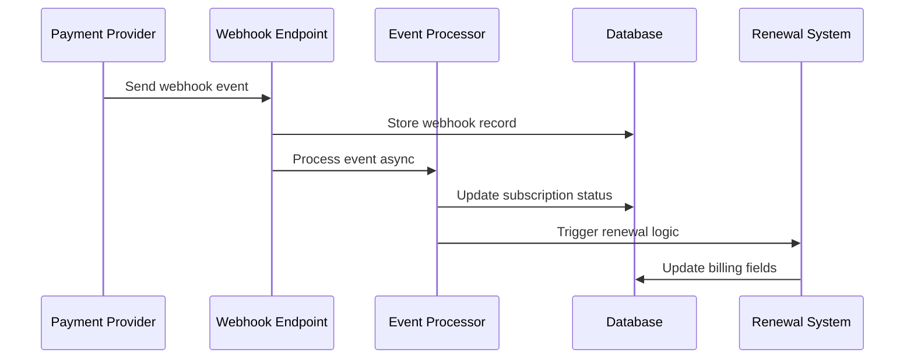

# Subscriptions API Reference

The Subscriptions API allows you to create, manage, and monitor recurring subscriptions for both authenticated users and guest customers. This API supports various subscription models including trials, different billing intervals, and guest subscriptions.

## ⚠️ Implementation Status

**Current Status**: Database-only implementation with webhook support
- ✅ **Database Operations**: Full CRUD operations for subscriptions
- ✅ **Webhook Handlers**: Stripe and PayPal webhook processing
- ✅ **Renewal System**: Automatic billing and retry logic
- ⚠️ **Provider Integration**: Not yet implemented (local subscriptions only)
- ⚠️ **Payment Processing**: Requires manual provider setup

**Provider Integration**: The subscription endpoints currently create local database records with placeholder provider IDs. Full provider integration (Stripe subscriptions, PayPal billing agreements) is planned for future implementation.

## Base URL

```
https://your-api-domain.com/bridge-payment
```

## Authentication

- **Authenticated Users**: Include `Authorization: Bearer <token>` header
- **Guest Users**: No authentication required, provide `guest_data` in request
- **Organizations**: Include organization context in request

## Subscription Flow

1. **Create Customer**: Ensure customer exists (user, organization, or guest)
2. **Create Subscription**: Initialize subscription with product and payment method
3. **Manage Subscription**: Update, cancel, or modify subscription
4. **Handle Webhooks**: Process subscription events from payment provider
5. **Renewal Processing**: Automatic billing through renewal system

## Current Implementation Features

### ✅ Fully Implemented
- **Database Schema**: Complete subscription tables with billing fields
- **CRUD Operations**: Create, read, update, delete subscriptions
- **Product Integration**: Product-based and custom subscriptions
- **Guest Support**: Full guest subscription functionality
- **Organization Support**: Multi-tenant subscription management
- **Webhook Processing**: Stripe and PayPal event handling
- **Renewal System**: Automatic billing with retry logic
- **Admin Interface**: System monitoring and manual controls
- **Enhanced Tracking**: Advanced tracking fields for analytics and provider integration
- **Provider Integration**: Concept field used as subscription title in Stripe/PayPal

### ⚠️ Partially Implemented
- **Provider Integration**: Database records only (no actual provider subscriptions)
- **Payment Processing**: Manual setup required for actual billing

### 🔄 Planned Features
- **Full Stripe Integration**: Automatic Stripe subscription creation
- **PayPal Billing Agreements**: PayPal subscription support
- **Provider Synchronization**: Two-way sync with payment providers

## Endpoints Overview

| Method | Endpoint | Description | Auth Required |
|--------|----------|-------------|---------------|
| POST | `/subscriptions` | Create subscription | Optional |
| GET | `/subscriptions/:id` | Get subscription by ID | Optional |
| GET | `/subscriptions` | List subscriptions | Yes |
| PUT | `/subscriptions/:id` | Update subscription | Optional |
| POST | `/subscriptions/:id/cancel` | Cancel subscription | Optional |
| POST | `/subscriptions/:id/reactivate` | Reactivate subscription | Optional |
| GET | `/subscriptions/guest/:email` | Get guest subscriptions | No |

---

## Create Subscription

Create a new subscription for a customer.

### Request

```http
POST /bridge-payment/subscriptions
```

#### Headers

```http
Authorization: Bearer <token>  # Optional for authenticated users
Content-Type: application/json
```

#### Request Body

| Field | Type | Required | Description |
|-------|------|----------|-------------|
| `customer_id` | string | Yes | Customer ID from provider_customers table |
| `product_id` | string | No | Product/plan ID to subscribe to (optional for custom subscriptions) |
| `payment_method_id` | string | Yes | Payment method ID for billing |
| `provider_id` | string | No | Payment provider (default: "stripe") |
| `organization_id` | string | No | Organization ID (overrides user's organization) |
| `trial_days` | number | No | Trial period in days (default: 0) |
| `price_cents` | number | No* | Price in cents (*required for custom subscriptions) |
| `currency` | string | No* | Currency code (*required for custom subscriptions) |
| `billing_interval` | string | No* | Billing frequency (*required for custom subscriptions) |
| `custom_price_cents` | number | No | Override product price (for product-based subscriptions) |
| `custom_trial_days` | number | No | Override product trial days (for product-based subscriptions) |
| `metadata` | object | No | Additional metadata |
| `guest_data` | object | No* | Guest customer data (*required for guests) |
| `guest_data.email` | string | Yes | Guest email address |
| `guest_data.name` | string | Yes | Guest full name |
| `guest_data.phone` | string | No | Guest phone number (optional) |
| **Enhanced Tracking Fields** | | | **Optional fields for analytics and provider integration** |
| `description` | string | No | Human-readable subscription description |
| `concept` | string | No | **Primary subscription title/name** (used in providers like Stripe) |
| `reference_code` | string | No | Machine-readable code for analytics |
| `category` | string | No | High-level category (default: "subscription") |
| `tags` | string | No | Comma-separated tags for flexible categorization |

### Response

```http
HTTP/1.1 201 Created
Content-Type: application/json
```

```json
{
  "id": "sub_1234567890",
  "customer_id": "cust_abcdef123456",
  "product_id": "prod_premium_plan",
  "payment_method_id": "pm_1234567890",
  "provider_id": "stripe",
  "provider_subscription_id": "sub_local_sub_1234567890",
  "status": "active",
  "current_period_start": "2025-01-15T10:30:00Z",
  "current_period_end": "2025-02-15T10:30:00Z",
  "cancel_at_period_end": false,
  "trial_end": null,
  "price_cents": 2999,
  "currency": "USD",
  "billing_interval": "monthly",
  "interval_multiplier": 1,
  "next_billing_date": "2025-02-15T10:30:00Z",
  "billing_status": "active",
  "description": "Premium Monthly Plan - Advanced features for business users",
  "concept": "Premium Monthly Plan",
  "reference_code": "sub_premium_monthly_2024",
  "category": "subscription",
  "tags": "premium,business,monthly",
  "is_guest_subscription": 0,
  "guest_email": null,
  "created_at": "2025-01-15T10:30:00Z"
}
```

**Note**: `provider_subscription_id` currently uses placeholder format `sub_local_{subscription_id}` until full provider integration is implemented.

**Provider Integration**: The `concept` field is automatically used as the subscription title in external providers like Stripe, ensuring consistency between your internal system and provider dashboards.

### Examples

#### Authenticated User Subscription (with tracking fields)
```bash
curl -X POST "https://api.example.com/bridge-payment/subscriptions" \
  -H "Authorization: Bearer your_token_here" \
  -H "Content-Type: application/json" \
  -d '{
    "customer_id": "cust_user_123456",
    "product_id": "prod_premium_monthly",
    "payment_method_id": "pm_card_visa_1234",
    "provider_id": "stripe",
    "trial_days": 7,
    "concept": "Premium Monthly Plan",
    "description": "Premium business subscription with advanced features",
    "reference_code": "sub_premium_monthly_2024",
    "category": "subscription",
    "tags": "premium,business,monthly,trial",
    "metadata": {
      "plan": "premium",
      "source": "website"
    }
  }'
```

**Note**: The `concept` field becomes the subscription title in Stripe dashboard.

#### Guest Subscription (with tracking fields)
```bash
curl -X POST "https://api.example.com/bridge-payment/subscriptions" \
  -H "Content-Type: application/json" \
  -d '{
    "customer_id": "cust_guest_789012",
    "product_id": "prod_basic_monthly",
    "payment_method_id": "pm_guest_card_5678",
    "provider_id": "stripe",
    "trial_days": 14,
    "concept": "Basic Monthly Plan",
    "description": "Basic subscription with essential features",
    "reference_code": "sub_basic_monthly_guest",
    "category": "subscription",
    "tags": "basic,monthly,trial,guest",
    "guest_data": {
      "email": "guest@example.com",
      "name": "Guest User"
    },
    "metadata": {
      "plan": "basic",
      "source": "landing_page"
    }
  }'
```

#### Organization Subscription
```bash
curl -X POST "https://api.example.com/bridge-payment/subscriptions" \
  -H "Authorization: Bearer org_token_here" \
  -H "Content-Type: application/json" \
  -d '{
    "customer_id": "cust_org_345678",
    "product_id": "prod_team_yearly",
    "payment_method_id": "pm_company_card_9012",
    "provider_id": "stripe",
    "organization_id": "org_456789",
    "metadata": {
      "plan": "team",
      "seats": 10,
      "billing_contact": "billing@company.com"
    }
  }'
```

#### Organization Custom Subscription (No Product, with tracking)
```bash
curl -X POST "https://api.example.com/bridge-payment/subscriptions" \
  -H "Authorization: Bearer org_token_here" \
  -H "Content-Type: application/json" \
  -d '{
    "customer_id": "cust_org_345678",
    "payment_method_id": "pm_company_card_9012",
    "provider_id": "stripe",
    "organization_id": "org_456789",
    "price_cents": 9999,
    "currency": "USD",
    "billing_interval": "monthly",
    "trial_days": 14,
    "concept": "Enterprise Custom Plan",
    "description": "Custom enterprise subscription with 50 seats and priority support",
    "reference_code": "sub_enterprise_custom_monthly",
    "category": "enterprise",
    "tags": "enterprise,custom,50seats,priority_support",
    "metadata": {
      "type": "custom_enterprise_plan",
      "seats": 50,
      "features": ["advanced_analytics", "priority_support"]
    }
  }'
```

**Note**: For custom subscriptions, the `concept` becomes the product name in Stripe.

---

## Guest Subscriptions

Guest subscriptions allow customers to create subscriptions without creating an account. This is perfect for quick checkouts and reducing friction in the subscription process.

### Guest Subscription Features

- ✅ **No Account Required**: Customers can subscribe using just email and name
- ✅ **Email Notifications**: Automatic subscription emails (creation, renewal, cancellation)
- ✅ **Full Lifecycle Support**: Create, manage, cancel, and reactivate guest subscriptions
- ✅ **Provider Integration**: Guest subscriptions work with Stripe, PayPal, and other providers
- ✅ **Webhook Support**: Automatic processing of subscription events
- ✅ **Guest Data Storage**: Secure storage of guest information for subscription management

### Guest Subscription Flow

1. **Customer provides email and name** (no account creation)
2. **Payment method is collected** and stored as guest payment method
3. **Subscription is created** with `is_guest_subscription: 1`
4. **Email notifications sent** for subscription events
5. **Guest can manage subscription** using email-based access

### Guest Subscription Fields

When creating a guest subscription, the following fields are automatically populated:

| Field | Type | Description |
|-------|------|-------------|
| `is_guest_subscription` | number | Set to `1` for guest subscriptions |
| `guest_data` | string | JSON string with guest information |
| `guest_email` | string | Extracted guest email for indexing |
| `user_id` | string | Set to `null` for guest subscriptions |

### Guest Subscription Example

```bash
curl -X POST "https://api.example.com/bridge-payment/subscriptions" \
  -H "Content-Type: application/json" \
  -d '{
    "customer_id": "cust_guest_789012",
    "product_id": "prod_basic_monthly",
    "payment_method_id": "pm_guest_card_5678",
    "provider_id": "stripe",
    "trial_days": 14,
    "concept": "Basic Monthly Plan",
    "description": "Basic subscription with essential features",
    "reference_code": "sub_basic_monthly_guest",
    "category": "subscription",
    "tags": "basic,monthly,trial,guest",
    "guest_data": {
      "email": "guest@example.com",
      "name": "John Doe",
      "phone": "+1234567890"
    },
    "metadata": {
      "plan": "basic",
      "source": "landing_page",
      "guest_checkout": true
    }
  }'
```

### Guest Subscription Response

```json
{
  "id": "sub_guest_1234567890",
  "customer_id": "cust_guest_789012",
  "product_id": "prod_basic_monthly",
  "payment_method_id": "pm_guest_card_5678",
  "provider_id": "stripe",
  "provider_subscription_id": "sub_stripe_guest_xyz789",
  "status": "trialing",
  "current_period_start": "2025-01-15T10:30:00Z",
  "current_period_end": "2025-02-15T10:30:00Z",
  "cancel_at_period_end": false,
  "trial_end": "2025-01-29T10:30:00Z",
  "price_cents": 999,
  "currency": "USD",
  "billing_interval": "monthly",
  "concept": "Basic Monthly Plan",
  "description": "Basic subscription with essential features",
  "reference_code": "sub_basic_monthly_guest",
  "category": "subscription",
  "tags": "basic,monthly,trial,guest",
  "is_guest_subscription": 1,
  "guest_email": "guest@example.com",
  "created_at": "2025-01-15T10:30:00Z"
}
```

### Guest Email Notifications

Guest subscriptions automatically trigger email notifications for:

- **Subscription Created**: Welcome email with subscription details
- **Payment Success**: Confirmation of successful recurring payments
- **Payment Failed**: Notification with retry instructions
- **Subscription Cancelled**: Cancellation confirmation with access details
- **Trial Ending**: Reminder before trial expires

All emails are sent in the customer's preferred language (Spanish/English) based on the `GLOBAL_LANG` environment variable.

### Managing Guest Subscriptions

#### Get Guest Subscriptions by Email

```bash
curl -X GET "https://api.example.com/bridge-payment/subscriptions/guest/guest@example.com" \
  -H "Content-Type: application/json"
```

#### Cancel Guest Subscription

```bash
curl -X POST "https://api.example.com/bridge-payment/subscriptions/sub_guest_1234567890/cancel" \
  -H "Content-Type: application/json" \
  -d '{
    "cancel_at_period_end": true,
    "reason": "Customer requested cancellation"
  }'
```

#### Reactivate Guest Subscription

```bash
curl -X POST "https://api.example.com/bridge-payment/subscriptions/sub_guest_1234567890/reactivate" \
  -H "Content-Type: application/json"
```

### Guest to User Conversion

Guests can later create accounts and convert their guest subscriptions to user subscriptions using the guest conversion endpoint:

```bash
curl -X POST "https://api.example.com/bridge-payment/guest-conversion" \
  -H "Authorization: Bearer new_user_token" \
  -H "Content-Type: application/json" \
  -d '{
    "guest_email": "guest@example.com"
  }'
```

This will:
1. Transfer all guest subscriptions to the new user account
2. Update `is_guest_subscription` to `0`
3. Set `user_id` to the new user's ID
4. Preserve all subscription history and settings

---

## Get Subscription by ID

Retrieve a specific subscription by its ID.

### Request

```http
GET /bridge-payment/subscriptions/{id}
```

#### Path Parameters

| Parameter | Type | Required | Description |
|-----------|------|----------|-------------|
| `id` | string | Yes | Subscription ID |

#### Headers

```http
Authorization: Bearer <token>  # Optional for authenticated users
Content-Type: application/json
```

### Response

```http
HTTP/1.1 200 OK
Content-Type: application/json
```

```json
{
  "id": "sub_1234567890",
  "user_id": "user_123456",
  "organization_id": null,
  "customer_id": "cust_abcdef123456",
  "product_id": "prod_premium_plan",
  "payment_method_id": "pm_1234567890",
  "provider_id": "stripe",
  "provider_subscription_id": "sub_stripe_xyz789",
  "status": "active",
  "current_period_start": "2025-01-15T10:30:00Z",
  "current_period_end": "2025-02-15T10:30:00Z",
  "cancel_at_period_end": false,
  "trial_end": null,
  "price_cents": 2999,
  "currency": "USD",
  "metadata": {
    "plan": "premium",
    "source": "website"
  },
  "description": "Premium Monthly Plan - Advanced features for business users",
  "concept": "Premium Monthly Plan",
  "reference_code": "sub_premium_monthly_2024",
  "category": "subscription",
  "tags": "premium,business,monthly",
  "created_at": "2025-01-15T10:30:00Z",
  "updated_at": "2025-01-15T10:30:00Z"
}
```

### Examples

#### Get Subscription
```bash
curl -X GET "https://api.example.com/bridge-payment/subscriptions/sub_1234567890" \
  -H "Authorization: Bearer your_token_here" \
  -H "Content-Type: application/json"
```

---

## List Subscriptions

Retrieve a list of subscriptions for the authenticated user or organization.

### Request

```http
GET /bridge-payment/subscriptions
```

#### Query Parameters

| Parameter | Type | Required | Description |
|-----------|------|----------|-------------|
| `status` | string | No | Filter by status (active, canceled, past_due, trialing) |
| `limit` | number | No | Number of results (default: 20, max: 100) |
| `offset` | number | No | Pagination offset (default: 0) |

#### Headers

```http
Authorization: Bearer <token>  # Required
Content-Type: application/json
```

### Response

```http
HTTP/1.1 200 OK
Content-Type: application/json
```

```json
{
  "subscriptions": [
    {
      "id": "sub_1234567890",
      "customer_id": "cust_abcdef123456",
      "product_id": "prod_premium_plan",
      "status": "active",
      "price_cents": 2999,
      "currency": "USD",
      "current_period_start": "2025-01-15T10:30:00Z",
      "current_period_end": "2025-02-15T10:30:00Z",
      "created_at": "2025-01-15T10:30:00Z"
    }
  ],
  "total": 1,
  "limit": 20,
  "offset": 0
}
```

### Examples

#### List Active Subscriptions
```bash
curl -X GET "https://api.example.com/bridge-payment/subscriptions?status=active&limit=10" \
  -H "Authorization: Bearer your_token_here" \
  -H "Content-Type: application/json"
```

---

## Cancel Subscription

Cancel a subscription at the end of the current billing period.

### Request

```http
POST /bridge-payment/subscriptions/{id}/cancel
```

#### Path Parameters

| Parameter | Type | Required | Description |
|-----------|------|----------|-------------|
| `id` | string | Yes | Subscription ID |

#### Headers

```http
Authorization: Bearer <token>  # Optional for authenticated users
Content-Type: application/json
```

#### Request Body

| Field | Type | Required | Description |
|-------|------|----------|-------------|
| `cancel_at_period_end` | boolean | No | Cancel at period end (default: true) |
| `reason` | string | No | Cancellation reason |

### Response

```http
HTTP/1.1 200 OK
Content-Type: application/json
```

```json
{
  "id": "sub_1234567890",
  "status": "active",
  "cancel_at_period_end": true,
  "current_period_end": "2025-02-15T10:30:00Z",
  "message": "Subscription will be canceled at the end of the current period",
  "updated_at": "2025-01-20T15:45:00Z"
}
```

### Examples

#### Cancel at Period End
```bash
curl -X POST "https://api.example.com/bridge-payment/subscriptions/sub_1234567890/cancel" \
  -H "Authorization: Bearer your_token_here" \
  -H "Content-Type: application/json" \
  -d '{
    "cancel_at_period_end": true,
    "reason": "Customer requested cancellation"
  }'
```

#### Cancel Immediately
```bash
curl -X POST "https://api.example.com/bridge-payment/subscriptions/sub_1234567890/cancel" \
  -H "Authorization: Bearer your_token_here" \
  -H "Content-Type: application/json" \
  -d '{
    "cancel_at_period_end": false,
    "reason": "Immediate cancellation requested"
  }'
```

---

## Get Guest Subscriptions

Retrieve subscriptions for a guest customer by email address.

### Request

```http
GET /bridge-payment/subscriptions/guest/{email}
```

#### Path Parameters

| Parameter | Type | Required | Description |
|-----------|------|----------|-------------|
| `email` | string | Yes | Guest email address |

#### Headers

```http
Content-Type: application/json
```

### Response

```http
HTTP/1.1 200 OK
Content-Type: application/json
```

```json
{
  "subscriptions": [
    {
      "id": "sub_guest_789012",
      "customer_id": "cust_guest_345678",
      "product_id": "prod_basic_monthly",
      "status": "trialing",
      "price_cents": 999,
      "currency": "USD",
      "trial_end": "2025-01-29T10:30:00Z",
      "current_period_start": "2025-01-15T10:30:00Z",
      "current_period_end": "2025-02-15T10:30:00Z",
      "guest_info": {
        "email": "guest@example.com",
        "name": "Guest User"
      },
      "created_at": "2025-01-15T10:30:00Z"
    }
  ],
  "total": 1
}
```

### Examples

#### Get Guest Subscriptions
```bash
curl -X GET "https://api.example.com/bridge-payment/subscriptions/guest/guest@example.com" \
  -H "Content-Type: application/json"
```

---

## Enhanced Tracking Fields

The Subscriptions API supports enhanced tracking fields for better analytics, categorization, and provider integration.

### Tracking Fields Overview

| Field | Type | Description | Provider Integration |
|-------|------|-------------|---------------------|
| `concept` | string | **Primary subscription title/name** | Used as subscription title in Stripe, PayPal |
| `description` | string | Human-readable description | Used as product description in providers |
| `reference_code` | string | Machine-readable analytics code | Included in provider metadata |
| `category` | string | High-level category grouping | Included in provider metadata |
| `tags` | string | Comma-separated flexible tags | Included in provider metadata |

### Provider Integration

**Stripe Integration:**
- `concept` → Subscription description and product name
- `description` → Product description
- All tracking fields → Subscription metadata

**PayPal Integration:**
- `concept` → Billing agreement description
- All tracking fields → Agreement metadata

### Auto-Generation

When tracking fields are not provided, the system automatically generates them:

**Product-Based Subscriptions:**
```json
{
  "concept": "Premium Monthly Plan",
  "description": "Premium Monthly Plan - monthly subscription",
  "reference_code": "subscription_monthly_prod_premium_monthly",
  "category": "subscription",
  "tags": null
}
```

**Custom Subscriptions:**
```json
{
  "concept": "Custom Monthly Subscription",
  "description": "Custom monthly subscription - $99.99",
  "reference_code": "subscription_custom_monthly",
  "category": "subscription",
  "tags": null
}
```

### Usage Examples

#### Analytics Tracking
```bash
# Subscription with detailed tracking for analytics
{
  "concept": "Premium Business Plan",
  "reference_code": "sub_premium_business_q1_2024",
  "category": "subscription",
  "tags": "premium,business,quarterly,promotion"
}
```

#### Campaign Tracking
```bash
# Subscription from marketing campaign
{
  "concept": "Holiday Special Plan",
  "reference_code": "sub_holiday_special_2024",
  "category": "promotion",
  "tags": "holiday,special,limited_time,discount"
}
```

#### Custom Service Tracking
```bash
# Custom consulting subscription
{
  "concept": "Monthly Consulting Service",
  "description": "Monthly consulting service - 10 hours included",
  "reference_code": "consulting_monthly_10h",
  "category": "service",
  "tags": "consulting,monthly,10hours,professional"
}
```

---

## Subscription Status Values

| Status | Description |
|--------|-------------|
| `active` | Subscription is active and billing normally |
| `trialing` | Subscription is in trial period |
| `past_due` | Payment failed, subscription is past due |
| `canceled` | Subscription has been canceled |
| `incomplete` | Initial payment failed or requires action |
| `incomplete_expired` | Initial payment failed and expired |

---

## Error Responses

### Common Error Codes

| Status Code | Error | Description |
|-------------|-------|-------------|
| 400 | Bad Request | Invalid request data or subscription parameters |
| 401 | Unauthorized | Invalid or missing authentication token |
| 403 | Forbidden | Access denied - not the subscription owner |
| 404 | Not Found | Subscription not found |
| 409 | Conflict | Subscription already exists or in invalid state |
| 422 | Validation Error | Request data failed validation |
| 500 | Internal Server Error | Server error |

### Error Response Format

```json
{
  "error": "Subscription creation failed",
  "message": "Customer already has an active subscription for this product",
  "timestamp": "2025-01-15T18:00:00Z",
  "details": {
    "customer_id": "cust_123456",
    "product_id": "prod_premium_plan",
    "existing_subscription_id": "sub_existing_789"
  }
}
```

### Example Error Responses

#### Subscription Already Exists
```http
HTTP/1.1 409 Conflict
Content-Type: application/json
```

```json
{
  "error": "Subscription conflict",
  "message": "Customer already has an active subscription for this product",
  "timestamp": "2025-01-15T18:00:00Z",
  "details": {
    "customer_id": "cust_123456",
    "product_id": "prod_premium_plan",
    "existing_subscription_id": "sub_existing_789"
  }
}
```

#### Payment Method Required
```http
HTTP/1.1 400 Bad Request
Content-Type: application/json
```

```json
{
  "error": "Payment method required",
  "message": "A valid payment method is required to create a subscription",
  "timestamp": "2025-01-15T18:00:00Z",
  "details": {
    "payment_method_id": null,
    "customer_id": "cust_123456"
  }
}
```

---

## Organization Support

The Subscriptions API fully supports organizations, allowing you to create and manage subscriptions for organizational customers.

### Organization Features

- ✅ **Organization ID Support**: Pass `organization_id` in request body
- ✅ **Automatic Detection**: Uses user's organization if not specified
- ✅ **Access Control**: Users can access subscriptions from their organization
- ✅ **Product-based**: Full support for organizational product subscriptions
- ✅ **Custom Subscriptions**: Support for custom enterprise pricing
- ✅ **Guest Support**: Organizations can create guest subscriptions

### Organization vs User Subscriptions

| Feature | User Subscription | Organization Subscription |
|---------|------------------|---------------------------|
| **Authentication** | User token required | User token with org access |
| **Access Control** | User ID verification | User ID OR Organization ID |
| **Billing** | Personal billing | Organizational billing |
| **Management** | User manages own | Org members can manage |
| **Custom Pricing** | Standard pricing | Enterprise pricing available |

### Organization Examples

#### 1. Organization Product Subscription
```bash
curl -X POST "https://api.example.com/bridge-payment/subscriptions" \
  -H "Authorization: Bearer org_user_token" \
  -H "Content-Type: application/json" \
  -d '{
    "customer_id": "cust_org_company_abc",
    "product_id": "prod_enterprise_plan",
    "payment_method_id": "pm_company_card",
    "organization_id": "org_company_abc_123",
    "metadata": {
      "department": "IT",
      "cost_center": "CC-2024-001",
      "seats": 100
    }
  }'
```

#### 2. Organization Custom Subscription (Enterprise Pricing)
```bash
curl -X POST "https://api.example.com/bridge-payment/subscriptions" \
  -H "Authorization: Bearer org_admin_token" \
  -H "Content-Type: application/json" \
  -d '{
    "customer_id": "cust_enterprise_xyz",
    "payment_method_id": "pm_enterprise_card",
    "organization_id": "org_enterprise_xyz_456",
    "price_cents": 49999,
    "currency": "USD",
    "billing_interval": "yearly",
    "trial_days": 30,
    "metadata": {
      "contract_id": "ENT-2024-XYZ-001",
      "seats": 500,
      "features": ["sso", "advanced_analytics", "priority_support"],
      "discount_percent": 20
    }
  }'
```

#### 3. Organization Guest Subscription
```bash
curl -X POST "https://api.example.com/bridge-payment/subscriptions" \
  -H "Content-Type: application/json" \
  -d '{
    "customer_id": "cust_guest_contractor",
    "payment_method_id": "pm_contractor_card",
    "organization_id": "org_company_abc_123",
    "product_id": "prod_contractor_access",
    "guest_data": {
      "email": "contractor@external.com",
      "name": "External Contractor"
    },
    "metadata": {
      "access_level": "contractor",
      "project": "PROJECT-2024-Q1"
    }
  }'
```

### Organization Access Control

The API automatically handles access control for organizations:

1. **User Access**: Users can access subscriptions where `user_id` matches
2. **Organization Access**: Users can access subscriptions where `organization_id` matches their organization
3. **Combined Access**: A user can access both personal and organizational subscriptions
4. **Guest Access**: Guests can only access their own subscriptions via email verification

### Organization Billing Scenarios

#### Scenario 1: Department Subscriptions
```json
{
  "organization_id": "org_company_123",
  "metadata": {
    "department": "Engineering",
    "cost_center": "ENG-2024-001",
    "manager": "john.doe@company.com"
  }
}
```

#### Scenario 2: Project-based Subscriptions
```json
{
  "organization_id": "org_agency_456",
  "metadata": {
    "project_id": "CLIENT-PROJECT-789",
    "client": "External Client Corp",
    "billable": true
  }
}
```

#### Scenario 3: Multi-tenant SaaS
```json
{
  "organization_id": "org_tenant_789",
  "metadata": {
    "tenant_id": "tenant_789",
    "plan_tier": "enterprise",
    "white_label": true
  }
}
```

---

## Workflow Examples

### Complete Subscription Flow for Authenticated User

#### Step 1: Create Customer (if not exists)
```bash
curl -X POST "https://api.example.com/bridge-payment/customers" \
  -H "Authorization: Bearer your_token_here" \
  -H "Content-Type: application/json" \
  -d '{
    "email": "user@example.com",
    "name": "John Doe",
    "provider_id": "stripe"
  }'
```

#### Step 2: Add Payment Method
```bash
curl -X POST "https://api.example.com/bridge-payment/payment-methods" \
  -H "Authorization: Bearer your_token_here" \
  -H "Content-Type: application/json" \
  -d '{
    "customer_id": "cust_user_123456",
    "type": "credit_card",
    "provider_id": "stripe",
    "payment_method_token": "pm_card_visa"
  }'
```

#### Step 3: Create Subscription
```bash
curl -X POST "https://api.example.com/bridge-payment/subscriptions" \
  -H "Authorization: Bearer your_token_here" \
  -H "Content-Type: application/json" \
  -d '{
    "customer_id": "cust_user_123456",
    "product_id": "prod_premium_monthly",
    "payment_method_id": "pm_card_visa_1234",
    "provider_id": "stripe",
    "trial_days": 7
  }'
```

### Complete Guest Subscription Flow

#### Step 1: Create Guest Customer
```bash
curl -X POST "https://api.example.com/bridge-payment/customers" \
  -H "Content-Type: application/json" \
  -d '{
    "email": "guest@example.com",
    "name": "Guest User",
    "provider_id": "stripe",
    "is_guest": true
  }'
```

#### Step 2: Add Guest Payment Method
```bash
curl -X POST "https://api.example.com/bridge-payment/payment-methods/direct" \
  -H "Content-Type: application/json" \
  -d '{
    "customer_id": "cust_guest_789012",
    "card_number": "4242424242424242",
    "exp_month": "12",
    "exp_year": "2025",
    "cvc": "123",
    "provider_id": "stripe",
    "guest_data": {
      "email": "guest@example.com",
      "name": "Guest User"
    }
  }'
```

#### Step 3: Create Guest Subscription
```bash
curl -X POST "https://api.example.com/bridge-payment/subscriptions" \
  -H "Content-Type: application/json" \
  -d '{
    "customer_id": "cust_guest_789012",
    "product_id": "prod_basic_monthly",
    "payment_method_id": "pm_guest_card_5678",
    "provider_id": "stripe",
    "trial_days": 14,
    "guest_data": {
      "email": "guest@example.com",
      "name": "Guest User"
    }
  }'
```

### Guest to User Conversion

When a guest creates an account, their subscriptions can be transferred:

#### Step 1: Create User Account
```bash
curl -X POST "https://api.example.com/auth/register" \
  -H "Content-Type: application/json" \
  -d '{
    "email": "guest@example.com",
    "password": "secure_password",
    "name": "John Doe"
  }'
```

#### Step 2: Convert Guest Subscriptions
```bash
curl -X POST "https://api.example.com/bridge-payment/subscriptions/convert-guest" \
  -H "Authorization: Bearer new_user_token" \
  -H "Content-Type: application/json" \
  -d '{
    "guest_email": "guest@example.com"
  }'
```

---

## Webhook Integration

The subscription system includes comprehensive webhook support for processing subscription events from payment providers.

### Supported Webhook Events

#### Stripe Events
- `invoice.payment_succeeded` - Successful subscription renewal
- `invoice.payment_failed` - Failed subscription payment
- `customer.subscription.updated` - Subscription changes
- `customer.subscription.deleted` - Subscription cancellation

#### PayPal Events
- `BILLING.SUBSCRIPTION.PAYMENT.COMPLETED` - Successful payment
- `BILLING.SUBSCRIPTION.PAYMENT.FAILED` - Failed payment
- `BILLING.SUBSCRIPTION.CANCELLED` - Subscription cancelled
- `BILLING.SUBSCRIPTION.SUSPENDED` - Subscription suspended

### Webhook Endpoints

```http
POST /bridge-payment/webhooks/stripe
POST /bridge-payment/webhooks/paypal
POST /bridge-payment/webhooks/renewals/stripe
POST /bridge-payment/webhooks/renewals/paypal
POST /bridge-payment/webhooks/renewals/test
```

### Webhook Processing Flow



### Example Webhook Processing

#### Successful Renewal
```json
{
  "type": "invoice.payment_succeeded",
  "data": {
    "object": {
      "subscription": "sub_stripe_xyz789",
      "customer": "cus_stripe_abc123",
      "amount_paid": 2999,
      "currency": "usd"
    }
  }
}
```

**Processing Result**:
- Subscription status updated to `active`
- Billing period advanced to next cycle
- Retry count reset to 0
- Receipt email sent to customer

#### Failed Payment
```json
{
  "type": "invoice.payment_failed",
  "data": {
    "object": {
      "subscription": "sub_stripe_xyz789",
      "customer": "cus_stripe_abc123",
      "amount_due": 2999,
      "attempt_count": 1
    }
  }
}
```

**Processing Result**:
- Subscription status updated to `past_due`
- Retry count incremented
- Next retry scheduled
- Customer notification sent

---

## Renewal System

The subscription renewal system provides automatic billing, retry logic, and comprehensive monitoring.

### Key Features

- **Automatic Billing**: Daily cron job processes due subscriptions
- **Retry Logic**: Configurable retry attempts with exponential backoff
- **Flexible Intervals**: Support for daily, weekly, monthly, yearly billing
- **Custom Frequencies**: Interval multipliers (e.g., every 2 months)
- **Admin Interface**: Real-time monitoring and manual controls

### Billing Configuration

```typescript
// Standard intervals
{ billing_interval: 'monthly', interval_multiplier: 1 }   // Monthly
{ billing_interval: 'yearly', interval_multiplier: 1 }    // Yearly

// Custom frequencies
{ billing_interval: 'monthly', interval_multiplier: 3 }   // Quarterly
{ billing_interval: 'monthly', interval_multiplier: 6 }   // Semi-annually
```

### Admin Endpoints

```http
GET /bridge-payment/admin/renewals/status      # System status
POST /bridge-payment/admin/renewals/trigger    # Manual processing
GET /bridge-payment/admin/renewals/due         # Due subscriptions
GET /bridge-payment/admin/renewals/retries     # Retry queue
POST /bridge-payment/admin/renewals/pause      # Pause system
POST /bridge-payment/admin/renewals/resume     # Resume system
```

### Environment Configuration

```bash
# Enable renewal system
RENEWALS_ENABLED=true

# Cron schedules
RENEWAL_DAILY_CRON="0 2 * * *"        # Daily at 2 AM UTC
RENEWAL_RETRY_CRON="0 * * * *"        # Every hour

# Processing limits
RENEWAL_BATCH_SIZE=50                  # Subscriptions per batch
RENEWAL_MAX_CONCURRENT=10              # Concurrent renewals
RENEWAL_MAX_RETRY_ATTEMPTS=3           # Max retry attempts
```

---

## Best Practices

### 1. Trial Management
- Always specify trial period for new subscriptions
- Monitor trial end dates and send reminders
- Handle trial-to-paid conversions gracefully

### 2. Guest Subscriptions
- Collect minimal required information for guests
- Provide easy conversion path to full accounts
- Maintain guest subscription history after conversion

### 3. Error Handling
- Always check subscription status before operations
- Handle payment failures gracefully
- Implement retry logic for temporary failures

### 4. Webhook Integration
- Set up webhooks for subscription events
- Handle all subscription status changes
- Implement idempotency for webhook processing

### 5. Customer Communication
- Send confirmation emails for new subscriptions
- Notify customers of upcoming renewals
- Provide clear cancellation processes
